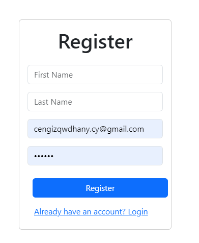
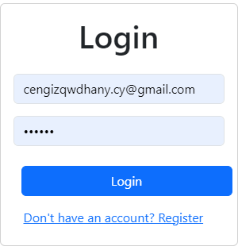
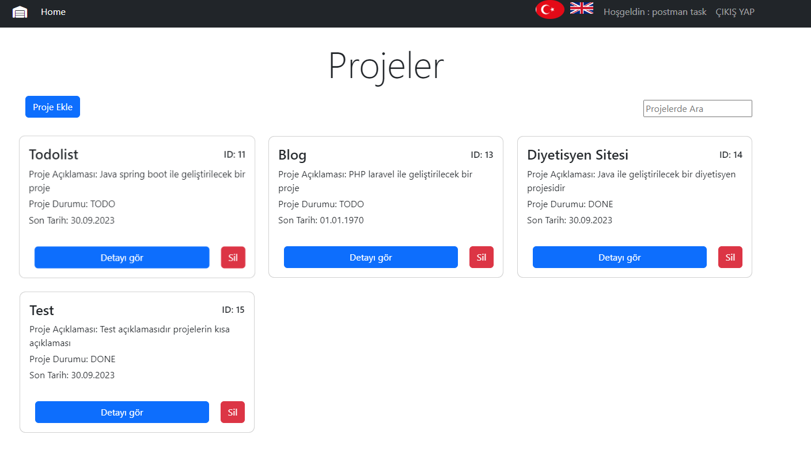
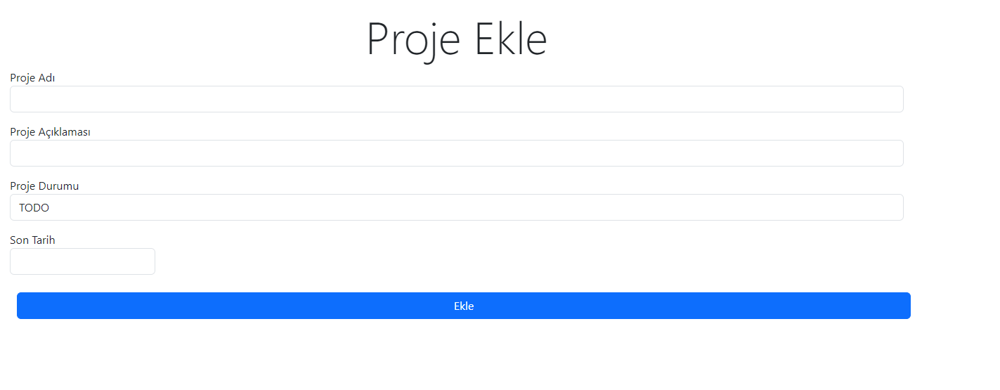
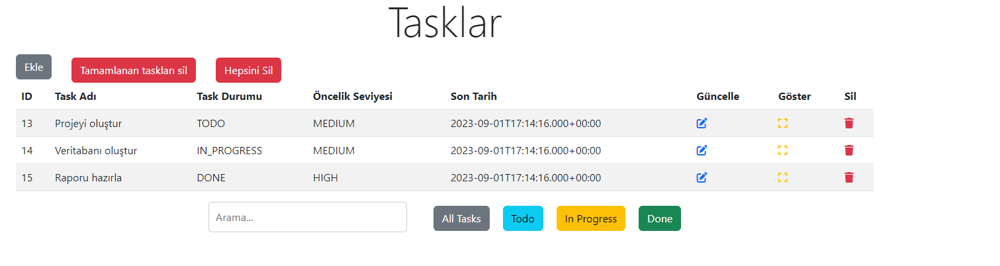
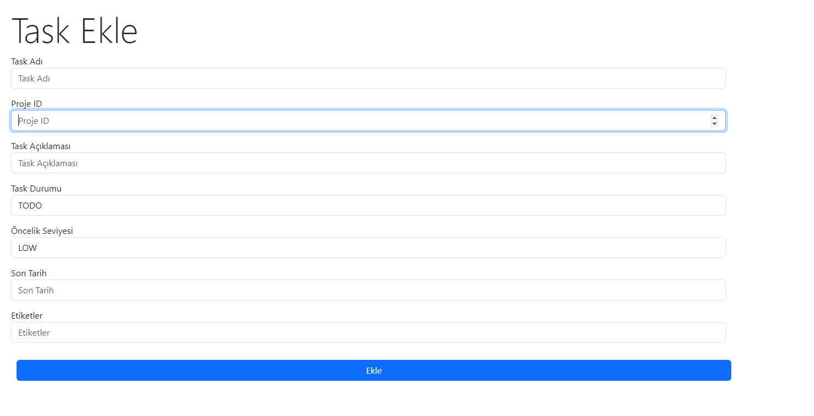
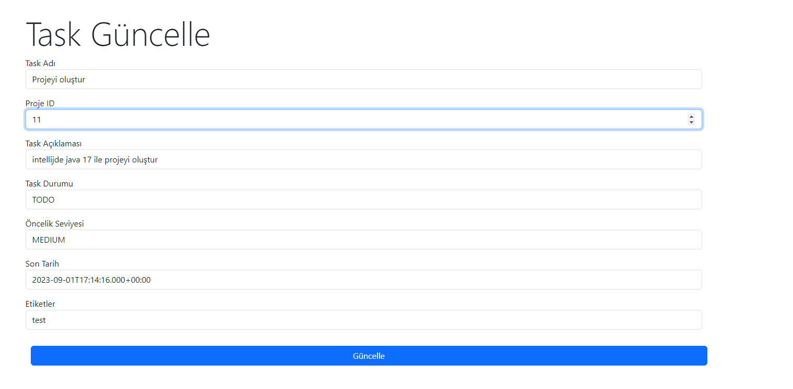
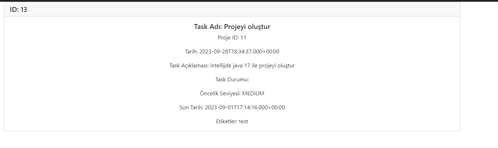

# JAVA TODO LIST

This project is developed using Java Spring Boot framework with a layered architecture. The project utilizes Java's Hibernate, Security, and Spring Data frameworks. Additionally, JWT (JSON Web Token) services are used for authentication and authorization processes. On the front-end side, the JavaScript Axios library is employed for API communication.

The project provides a platform where users can register and log in. Users can create projects and add tasks to these projects. The task screen offers various filtering and search options.

Technologies Used
- Java Spring Boot
- Hibernate
- Spring Data
- Spring Security
- JWT (JSON Web Token)
- React (Front-end)
- JavaScript (Axios library)

This project offers a platform where users can create projects, add tasks, and manage them. Moreover, the user-friendly interface of the project facilitates easy execution of operations.


| Login                        | Register                  | Projects                     | Project Create                     |
|------------------------------|---------------------------|------------------------------|------------------------------------|
|  |  |  |  |

| Tasks                     | Task Create                     | Task Update                     | Task Detail                     |
|---------------------------|---------------------------------|---------------------------------|---------------------------------|
|  |  |  |  |

## Requirements
```
- Java 17 or higher
- Database (default is MySQL)
```

## Installation
1. Clone the project:

```
git clone https://github.com/Cengizhan1/java-todolist.git
``` 
2. Navigate to the project directory:

```
cd java-todolist
``` 

## Project Setup
1- Database Setup: \
MySQL is used as the default database. To configure your database to MySQL, edit the application.properties file. \
2- Start the Backend: \
To start the Spring Boot application, run the following command:
```
./mvnw spring-boot:run
``` 
3- Start the Frontend: \
To start the React application, run the following commands:
```
cd frontend
npm install
npm start
``` 
The project will run by default at http://localhost:3000

## API Documentation
You can find the API documentation here.
It provides detailed information on available routes and their usage.

postman : https://documenter.getpostman.com/view/16991416/2s9Y5cu18L \
swagger : http://localhost:4444/swagger-ui/index.html

## Contributers
Cengizhan Yavuz \
Email : cengizhany.cy@gmail.com
## License
This project is licensed under the MIT License. See the LICENSE file for more information.
